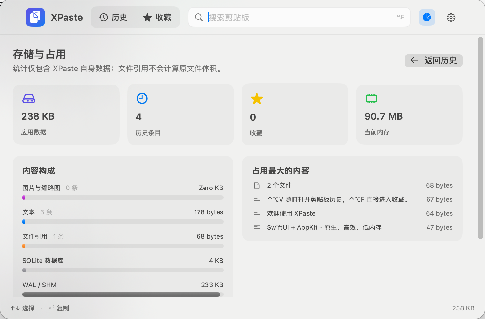
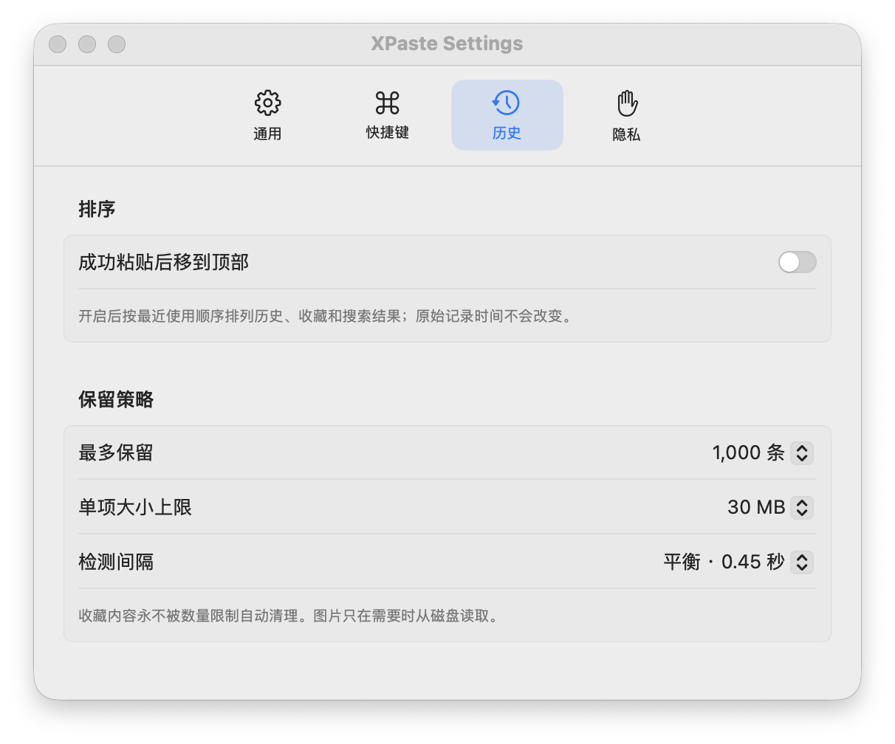

# XPaste

XPaste 是一款原生 macOS 菜单栏剪贴板工具。它记录文本、图片和 Finder 文件引用，支持收藏、搜索、二次编辑、全局快捷键、跨 Space / 全屏应用唤起，以及本地存储占用统计。

## 主要能力

- 文本、PNG/TIFF 图片、文件引用自动记录
- 文件引用逐项检测；支持失效状态、重新定位以及跳过不可用项继续粘贴
- SHA-256 内容去重；重复复制或编辑为已有内容时自动合并记录
- 默认单列的紧凑主面板；按空格、`⌘I` 或信息按钮按需展开详情与编辑区
- 时间按“刚刚 / N分钟前 / N小时前 / 昨天 / 具体日期”显示，悬停可查看精确记录时间
- 单击历史条目只选择，双击、点击粘贴按钮或按 Return 粘贴回唤起 XPaste 前的应用
- 顶部 Pin 按钮可固定窗口；固定后切换应用不收起，粘贴到当前应用后仍保持显示
- 可用 `←` / `→` 在历史与收藏之间切换；搜索或编辑文本时仍保留光标移动行为
- 可选“自动粘贴后移到顶部”，默认关闭且不会修改原始记录时间
- SQLite FTS5 异步搜索中文、英文、文件名和来源 App
- 文本原位编辑并保留未保存草稿；图片旋转、翻转、正方形裁剪与撤销
- 单条删除提供 5 秒撤销，批量清理需要二次确认
- `⌃⌥V` 全局打开历史，`⌃⌥F` 直接打开收藏
- `NSPanel` 跨 Space、Stage Manager 和全屏应用浮层
- 未授予辅助功能权限时自动降级为普通复制并给出提示
- SQLite WAL 元数据、图片原图 / 缩略图分离存储
- 统计文本、图片、文件引用、数据库、迁移归档以及当前进程内存占用
- 收藏内容不受自动数量清理影响
- 跳过密码管理器常用的 transient / concealed 剪贴板标记

## 界面






## 快捷键

| 操作 | 默认快捷键 |
|---|---|
| 全局打开 / 关闭历史 | `⌃⌥V` |
| 全局打开收藏 | `⌃⌥F` |
| 面板内历史 / 收藏 | `⌘1` / `⌘2` |
| 左右切换历史 / 收藏 | `←` / `→` |
| 聚焦搜索 | `⌘F` |
| 上一条 / 下一条 | `↑` / `↓` |
| 粘贴到原应用 | `Return` |
| 展开 / 收起详情 | `Space` / `⌘I` |
| 强制粘贴到原应用 | `⌘Return` |
| 收藏 / 取消收藏 | `⌘D` |
| 仅复制并保持面板 | `⌘C` |
| 关闭面板 | `Escape` |

全局快捷键可以在设置中点击录制，直接按下自定义组合键；支持字母、数字、标点、方向键和功能键，冲突时会自动恢复上一组有效快捷键。

## 构建

要求 macOS 14 或更高版本、Xcode 16 或更高版本。项目是标准 Swift Package，可直接在 Xcode 中打开 `Package.swift`。

```bash
swift test
swift build -c release
./scripts/build_app.sh
open dist/XPaste.app
```

`build_app.sh` 会生成并临时签名 `dist/XPaste.app`。正式分发时请替换为 Developer ID 签名并完成 notarization。

## 数据与隐私

数据默认保存在：

```text
~/Library/Application Support/XPaste/
```

XPaste 不包含网络请求或云端同步。全局快捷键由 Carbon 注册，不需要辅助功能权限。只有“向原应用自动发送 ⌘V”需要辅助功能授权；用户拒绝后不影响记录、搜索、收藏和普通复制。

## 性能设计

- 空闲时只比较 `NSPasteboard.changeCount`，默认 450 ms 一次
- SQLite 使用 WAL / `synchronous=NORMAL`，写入不会重写完整历史
- 搜索由 FTS5 trigram 索引、后台查询和 60 ms 输入防抖完成
- 图片原图不进入数据库，也不会常驻列表内存
- 缩略图最大边 420 px，`NSCache` 解码缓存硬上限 32 MB
- 面板按需创建；关闭 30 秒后释放视图树和缩略图缓存
- 剪贴板读取使用独立 actor；图片哈希、转码、缩略图和编辑在后台串行管线中完成
- 单项默认上限 30 MB，可配置；超大像素图片会主动拒绝
- 所有自写剪贴板内容携带会话标记，避免复制回流
- 收藏项永不由数量限制自动删除

## 工程结构

```text
Sources/XPasteCore   数据模型、SQLite 历史仓库、搜索与统计
Sources/XPaste       SwiftUI 界面、NSPanel、快捷键、剪贴板桥接
Tests/XPasteCoreTests
scripts              App 打包与图标生成
```
